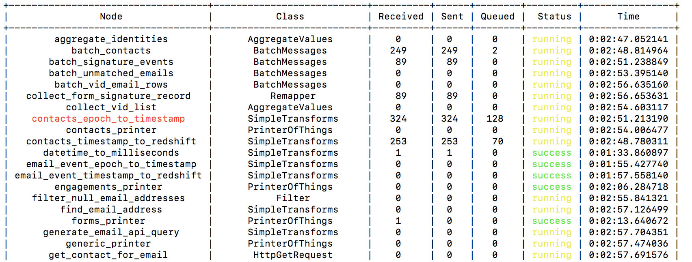

==========
Monitoring
==========

MetalPipe lets you easily monitor your pipeline, identify bottlenecks, and
help diagnose failures.

Logging table
-------------

While a pipeline is being executed, a table of information will periodically
be logged (at the INFO logging level). Each row provide diagnostic information
about a single node in the pipeline. This is a typical example:

  The logging table provides information about each node in a running pipeline.

We'll go through each column of the table.

The ``Node`` column contains the name of a node. This is the name that was
given in the configuration file as a top-level key in the ``nodes`` section.

If the name is printed in red (as in ``contacts_epoch_to_timestamp`` in the
example), then the node is a "bottleneck". In order to identify bottlenecks,
MetalPipe periodically polls each node to determine if (1) it input queue is
full and (2) its output queue is not full. If those conditions are frequently
met, then the node is identified as a bottleneck.

Note that being a bottleneck is not necessarily a sign of inefficiency. For
any sufficiently long-running pipeline, it is very likely that some node will
happen to be the slowest, and it will be considered a bottleneck.

The ``Class`` column simply gives the class of the ``MetalNode`` object, which
tells you what function it is performing.

The ``Received``, ``Sent``, and ``Queued`` columns tell you how many messages
are at various stages of processing. The ``Received`` number indicate how
many messages have been procesed by the node, including any message that is
currently being procesed. ``Sent`` gives how many messages have been output
by this node. Finally, ``Queued`` is the number of messages that are on that
nodes incoming queue(s). If there are several incoming queues, then this number
is the sum. Note that for a source node, the value of ``Received`` will always
be zero, and for any sink node, the value of ``Sent`` will be zero.

The ``Status`` column has three possible values: ``running``, ``success``, 
and ``error``. Here, ``success`` means that the node has completed its work
and has terminated without raising an error. A node is considered to be 
done with its work when its parent nodes (if any) have completed, its incoming
queues are all empty, and it is not processing any messages. An ``error`` is
indicated whenever a node raises an Exception. When this happens, the entire
pipeline is shut down automatically. These status messages are colored yellow,
green, and red respectively.

Finally ``Time`` is the total amount of time the node has spent running. When
it is in a non-running state (either ``success`` or ``error``), the clock stops.

