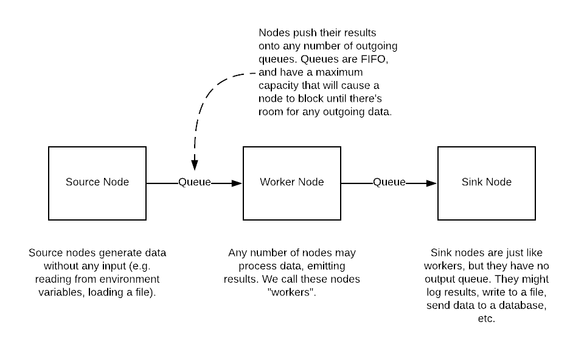

========
Overview
========

NanoStream is a package of classes and functions that help you write consistent, efficient, configuration-driven ETL pipelines in Python. It is open-source and
as simple as possible (but not simpler).

This overview tells you why NanoStream exists, and how it can help you escape from ETL hell.

Why is it?
----------

Tolstoy said that every happy family is the same, but every unhappy family is
unhappy in its own way. ETL pipelines are unhappy families.

Why are they so unhappy? Every engineer who does more than one project involving
ETL eventually goes through the same stages of ETL grief. First, they think it's
not so bad. Then they do another project and discover that they have to rewrite
very similar code. Then they think, "Surely, I could have just written a few
library functions and reused that code, saving lots of time." But when they try
to do this, they discover that although their ETL projects are very similar,
they are just different enough that their code isn't reusable. So they resign
themselves to rewriting code over and over again. The code is unreliable,
difficult to maintain, and usually poorly tested and documented because it's
such a pain to write in the first place. The task of writing ETL pipelines is
so lousy that engineering best practices tend to go out the window because
the engineer has better things to do.

What is it?
-----------

NanoStream is an ETL framework for the real world. It aims to provide structure and consistency to your ETL pipelines, while still allowing you to write bespoke code for all of the weird little idiosyncratic features of your data. It is opinionated without being bossy.

The overall idea of NanoStream is simple. On the surface, it looks a lot like streaming frameworks such as Spark or Storm. You hook up various tasks in a directed graph called a "pipeline". The pipeline ingests data from or more places, transforms it, and loads the data somewhere else. But it differs from Spark-like systems in important ways:

1. It is agnostic between stream and batch. Batches of data can be turned into streams and vice-versa.
#. It is lightweight, requiring no specialized infrastructure or network configuration.
#. Its built-in functionality is specifically designed for ETL tasks.
#. It is meant to accommodate 90% of your ETL needs entirely by writing configuration files.
   
What isn't it?
--------------

There are many things that NanoStream is not:

1. It is not a Big Data(tm) tool. If you're handling petabytes of data, you do
   not want to use NanoStream.
2. It is not suitable for large amounts of computation. If you need to use
   dataframes to calculate lots of complex statistical information in real-time,
   this is not the tool for you.

Basically, NanoStream deliberately makes two trade-offs: (1) it gives up Big Data(tm) for simplicity; and (2) it gives up being a general-purpose analytic tool in favor of being very good at ETL.

NanoStream pipelines
--------------------

An ETL pipeline in NanoStream is a series of nodes connected by queues. Data
is generated or processed in each node, and the output is placed on a queue to
be picked up by downstream nodes.

  Very high-level view of a NanoStream pipeline

For the sake of convenience, we distinguish between three types of nodes
(although there's no real difference in their use or implementation):

1. Source nodes. These are nodes that generate data and send it to the rest
   of the pipeline. They might, for example, read data from an external
   data source such as an API endpoint or a database.
#. Worker nodes. The workers process data by picking up messages from their
   incoming queues. Their output is placed onto any number of outgoing queues
   to be further processed by downstream nodes.
#. Sink nodes. These are worker nodes with no outgoing queue. They will
   typically perform tasks such as inserting data into a database or generating
   statistics to be sent somewhere outside the pipeline.

All pipelines are implemented in pure Python (version >=3.5). Each node is
instantiated from a class that inherits from the ``NanoNode`` class. Queues
are never instantiated directly by the user; they are created automatically
whenever two nodes are linked together.

There is a large (and growing) number of specialized ``NanoNode`` subclasses,
each geared toward a specific task. Such tasks include:

1. Querying a table in a SQL database and sending the results downstream.
#. Making a request to a REST API, paging through the responses until there are
   no more results.
#. Ingesting individual messages from an upstream node and batching them
   together into a single message, or doing the reverse.
#. Reading environment variables.
#. Watching a directory for new files and sending the names of those files
   down the pipeline when they appear.
#. Filtering messages, letting them through the pipeline only if a particular
   test is passed.

.. figure:: 10k_view.png
  :width: 600
  :alt: NanoNode diagram

  Somewhat high-level view of a NanoStream pipeline

All results and messages passed among the nodes must be dictionary-like
objects. By default, messages retain any keys and values that were created by upstream nodes. 

The goal is for NanoStream to be "batteries included", with built-in
``NanoNode`` subclasses for every common ETL task. But because ETL pipelines
generally have something weird going on somewhere, NanoNode makes it easy to
roll your own node classes;

Installing NanoStream
---------------------

NanoStream is installed in the usual way, with pip:

::

    pip install nanostream

To test your installation, try typing

::

    nanostream --help

If NanoStream is installed correctly, you should see a help message.

Using NanoStream
----------------

You use NanoStream by (1) writing a configuration file that describes your pipeline, and (2) running the ``nanostream`` command, specifying the location of your
configuration file. NanoStream will read the configuration, create the pipeline,
and run it.

The configuration file is written in YAML. It has three parts:

1. A list of global variables (optional)
#. The nodes and their options (required)
#. A list of edges connecting those nodes to each other.

This is a simple configuration file. If you want to, you can copy it into a
file called ``sample_config.yaml``:

::

    ---
    pipeline_name: Sample NanoStream configuration
    pipeline_description: Reads some environment variables and prints them

    nodes:
      get_environment_variables:
        class: GetEnvironmentVariables
        summary: Gets all the necessary environment variables
        options:
          environment_variables:
            - API_KEY
            - API_USER_ID

      print_variables:
        class: PrinterOfThings
        summary: Prints the environment variables to the terminal
        options:
          prepend: "Environment variables: "

    paths:
      - 
        - get_environment_variables
        - print_variables

If you've installed NanoStream and copied this configuration into ``sample_config.yaml``, then you can execute the pipeline:

::

    nanostream run --filename sample_config.yaml

The output should look like this (you might also see some log messages):

::
    
    Environment variables: 
    {'API_USER_ID': None, 'API_KEY': None}

The NanoStream pipeline has found the values of two environment variables (``API_KEY`` and ``API_USER_ID``) and printed them to the terminal. If those environmet variables have not been set, their values will be ``None``. But if you were to set any of them, their values would be printed.

Although this is a very trivial example, it is enough to show the main functionality of NanoStream. Let's look at the configuration file one 
part at a time.

The configuration starts with two top-level options, ``pipeline_name`` and ``pipeline_description``. These are optional, and are only used for the user's convenience.

Below those are two sections: ``nodes`` and ``paths``. Each ``nodes`` section contains one or more blocks that always have this form:

::

    do_something:
      class: node class
      summary: optional string describing what this node does
      options:
        option_1: value of this option
        option_2: value of another option

Let's go through this one line at a time.

Each node block describes a single node in the NanoStream pipeline. A node
must be given a name, which can be any arbitrary string. This should be a
short, descriptive string describing its action, such as ``get_environment_variables`` or ``parse_json``, for example. We encourage
you to stick to a clear naming convention. We like nodes to have names of
the form ``verb_noun`` (as in ``print_name``).

NanoStream contains a number of node classes, each of which is designed
for a specific type of ETL task. In the sample configuration, we're used
the built-in classes ``GetEnvironmentVariables`` and ``PrinterOfThings``; these are the value following ``class``. You can also roll your own node classes (we'll describe how to do this later in the documentation).

Next is a set of keys and values for the various options that are supported by that class. Because each node class does something different,
the options are different as well. In the sample configuration, the
``GetEnvironmentVariables`` node class requires a list of environment variables to retrieve, so as you would expect, we specify that list under the ``environment_variables`` option. The various options are explained in
the documentation for each class. In addition to the options that are specific to each node, there are also options that are common to every type of node. These will be explained later.

The structure of the pipeline is given in the ``paths`` section, which contains a list of lists. Each list is a set of nodes that are to be linked together in
order. In our example, the ``paths`` value says that
``get_environment_variables`` will send its output to ``print_variables``.
Paths can be arbitrarily long.

If you wanted to send the environment variables down two different execution
paths, you add another list to the ``paths``, like so:

::

    paths:
      - 
        - get_environment_variables
        - print_variables
      -
        - get_environment_variables
        - do_something_else
        - and_then_do_this

With this set of ``paths``, the pipeline looks like a very simple tree, with
``get_environment_variables`` at the root, which branches to
``print_variables`` and ``do_something_else``.

When you have written the configuration file, you're ready to use the
NanoStream CLI. It accepts a command, followed by some options. As of now, the
commands it accepts are ``run``, which executes the pipeline, and ``draw``,
which generates a diagram of the pipeline. The relevant command(s) are:

::

    python nanostream_cli.py [run | draw] --filename my_sample_config.yaml

The ``nanostream`` command can generate a pdf file containing a drawing of the pipeline, showing the flow of data through the various nodes. Just speciy ``draw`` instead of ``run`` to generate the diagram. For our simple little pipeline, we get this:

.. figure:: sample_config_drawing.pdf
  :width: 240
  :alt: Sample pipeline drawing

  The pipeline drawing for the simple configuration example

It is also possible to skip using the configuration file and define your
pipelines directly in code. In general, it's better to use the configuration
file for a variety of reasons, but you always have the option of doing this
in Python.

Nodes are defined in code by instantiating classes that inherit from
``NanoNode``. Upon instantiation, the constructor takes the same set of
keyword arguments as you see in the configuration. Nodes are linked together
by the ``>`` operator, as in ``node_1 > node_2``. After the pipeline has been
built in this way, it is started by calling ``node.global_start()`` on any
of the nodes in the pipeline.

The code corresponding to the configuration file above would look like this:

::

        # Define the nodes using the various subclasses of NanoNode
        get_environment_variables =
        GetEnvironmentVariables(
            environment_variables=['API_KEY', 'API_USER_ID'])
        print_variables = PrinterOfThings(prepend='Environment variables: ')

        # The '>' operator can also be chained, as in:
        # node_1 > node_2 > node_3 > ...
        get_environment_variables > print_variables

        # Run the pipeline. This command will not block.
        get_environment_variables.global_start()
    

Rolling your own ``NanoNode`` class
-----------------------------------

If there are no built-in ``NanoNode`` classes suitable for your ETL pipeline,
it is easy to write your own. 

For example, suppose you want to create a source node for your pipeline
that simply emits a user-defined string every few seconds forever. The user
would be able to specify the string and the number of seconds to pause after
each message has been sent. The class could be defined like so:

::

    class FooEmitter(NanoNode):  # inherit from NanoNode
        '''
        Sends ``self.output_string`` every ``self.interval`` seconds.
        '''
        def __init__(self, output_string='', interval=1, **kwargs):
            self.output_string = output_string
            self.interval = interval
            super(FooEmitter, self).__init__()  # Must call the `NanoNode` __init__

        def generator(self):
            while True:
                time.sleep(self.interval)
                yield self.output_string  # Output must be yielded, not returned

Let's look at each part of this class.

The first thing to note is that the class inherits from ``NanoNode`` -- this
is the mix-in class that gives the node all of its functionality within the
NanoStream framework.

The ``__init__`` method should take only keyword arguments, not positional
arguments. This restriction is to guarantee that the configuration files have
names for any options that are specified in the pipeline. In the ``__init__``
function, you should also be sure to accept ``**kwargs``, because options that
are common to all ``NanoNode`` objects are expected to be there.

After any attributes have been defined, the ``__init__`` method **must**
invoke the parent class's constructor through the use of the ``super``
function. Be sure to pass the ``**kwargs`` argument into the function as
shown in the example.

If the node class is intended to be used as a source node, then you need to
define a ``generator`` method. This method can be virtually anything, so long
as it sends its output via a ``yield`` statement.

If you need to define a worker node (that is, a node that accepts input
from a queue), you will provide a ``process_item`` method instead of a
``generator``. But the structure of that method is the same, with the single
exception that you will have access to a ``__message__`` attribute which
contains the incoming message data. The structure of a typical ``process_item``
method is shown in the figure.

  A typical ``process_item`` method for ``NanoNode`` objects

For example, let's suppose you want to create a node that is passed a string as a
message, and returns ``True`` if the message has an even number of
characters, ``False`` otherwise. The class definition would look like
this:

::

    class MessageLengthTester(NanoNode):
        def __init__(self):
            # No particular initialization required in this example
            super(MessageLengthTester, self).__init__()

        def process_item(self):
            if len(self.__message__) % 2 == 0:
                yield True 
            else:
                yield False

Composing and configuring ``NanoNode`` objects
----------------------------------------------

.. warning:: The code described in this section is experimental and very
   unstable. It would be bad to use it for anything important.

Let's suppose you've worked very hard to create the pipeline from the
last example. Now, your boss says that another engineering team wants to
use it, but they want to rename parameters and "freeze" the values of
certain other parameters to specific values. Once that's done, they want
to use it as just one part of a more complicated ``NanoStream``
pipeline.

This can be accomplished using a configuration file. When ``NanoStream``
parses the configuration file, it will dynamically create the desired
class, which can be instantiated and used as if it were a single node in
another pipeline.

The configuration file is written in YAML, and it would look like this:

::

    name: FooMessageTester

    nodes:
      - name: foo_generator
        class FooEmitter
        frozen_arguments:
          message: foobar
        arg_mapping:
          interval: foo_interval 
      - name: length_tester
        class: MessageLengthTester
        arg_mapping: null

With this file saved as (e.g.) ``foo_message.yaml``, the following code
will create a ``FooMessageTester`` class and instantiate it:

::

    foo_message_config = yaml.load(open('./foo_message.yaml', 'r').read())
    class_factory(foo_message_config)
    # At this point, there is now a `FooMessageTester` class
    foo_node = FooMessageTester(foo_interval=1)

You can now use ``foo_node`` just as you would any other node. So in
order to run it, you just do:

::

    foo_node.global_start()

Because ``foo_node`` is just another node, you can insert it into a
larger pipeline and reuse it. For example, suppose that other
engineering team wants to add a ``PrinterOfThings`` to the end of the
pipeline. They'd do this:

::

    printer = PrinterOfThings()
    foo_node > printer
