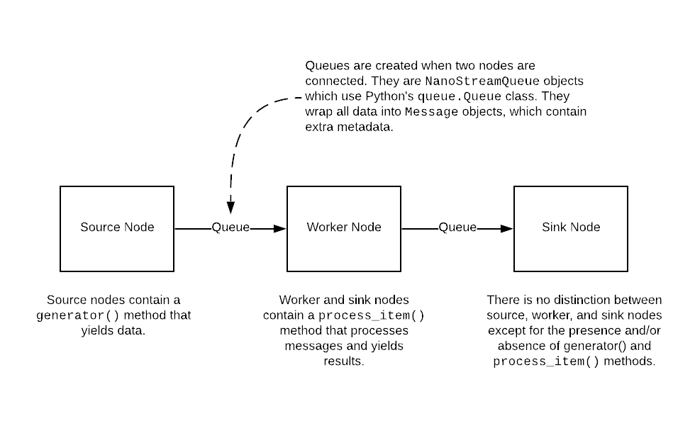

========
Overview
========

Why?
----

Tolstoy said that every happy family is the same, but every unhappy family is
unhappy in its own way. ETL pipelines are unhappy families.

Why are they so unhappy? Every engineer who does more than one project involving
ETL eventually goes through the same stages of ETL grief. First, they thing it's
not so bad. Then they do another project and discover that they have to rewrite
very similar code. Then they think, "Surely, I could have just written a few
library functions and reused that code, saving lots of time." But when they try
to do this, they discover that although their ETL projects are very similar,
they are just different enough that their code isn't reusable. So they resign
themselves to rewriting code over and over again. The code is unreliable,
difficult to maintain, and usually poorly tested and documented because it's
such a pain to write in the first place. The task of writing ETL pipelines is
so lousy that engineering best practices tend to go out the window because
the engineer has better things to do.

NanoStream is an ETL framework written in Python that tries to thread the ETL
needle. It is opinionated about how ETL pipelines ought to be written; it
provides a number of highly reusable and well-documented modules that are
useful in ETL tasks; and it has just enough flexibility to allow an engineer
to accommodate the strange idiosyncratic requirements of real-world ETL tasks.

The overall idea of NanoStream is simple. It is a streaming framework that
resembles stream-processing patterns such as those found in Spark, Storm, and
others. But unlike those tools, it requires no special infrastructure or
server because it runs entirely within one process. It also differs from
high-powered stream processing tools in that it is designed from the ground
up with ETL in mind.

Despite its superficial similarity to Spark and Storm, it is not intended to
compete with them in any way. NanoStream is not suitable for huge analytic
pipelines that require massive amounts of computation. You won't want to
analyze the Twitter firehose with NanoStream.

NanoStream pipelines
--------------------

An ETL pipeline in NanoStream is a series of nodes connected by queues. Data
is generated or processed in each node, and the output is placed on a queue to
be picked up by downstream nodes.

  Very high-level view of a NanoStream pipeline

For the sake of convenience, we distinguish between three types of nodes
(although there's no real difference in their use or implementation):

1. Source nodes. These are nodes that generate data and send it to the rest
   of the pipeline. They might, for example, read data from an external
   data source such as an API endpoint or a database.
#. Worker nodes. The workers process data by picking up messages from their
   incoming queues. Their output is placed onto any number of outgoing queues
   to be further processed by downstream nodes.
#. Sink nodes. These are worker nodes with no outgoing queue. They will
   typically perform tasks such as inserting data into a database or generating
   statistics to be sent somewhere outside the pipeline.

All pipelines are implemented in pure Python (version >=3.5). Each node is
instantiated from a class that inherits from the ``NanoNode`` class. Queues
are never instantiated directly by the user; they are created automatically
whenever two nodes are linked together.

There is a large (and growing) number of specialized ``NanoNode`` subclasses,
each geared toward a specific task. Such tasks include:

1. Querying a table in a SQL database and sending the results downstream.
#. Making a request to a REST API, paging through the responses until there are
   no more results.
#. Ingesting individual messages from an upstream node and batching them
   together into a single message, or doing the reverse.
#. Reading environment variables.
#. Watching a directory for new files and sending the names of those files
   down the pipeline when they appear.
#. Filtering messages, letting them through the pipeline only if a particular
   test is passed.

  Somewhat high-level view of a NanoStream pipeline

All results and messages passed among the nodes must be dictionary-like
objects. By default, messages hold the entire history of all the earlier
messages that led to its being generated.

The goal is for NanoStream to be fully "batteries included", with built-in
``NanoNode`` subclasses for every necessary ETL task. But because this is 
actually impossible, we try to make it easy to roll your own node classes.

Using built-in ``NanoNode`` classes
-----------------------------------

The most straightforward use of NanoStream actually requires no coding, per se.
You write a simple configuration file in YAML, and run the pipeline with the
built-in command line tool, ``nanostream_cli``. The tool reads the
configuration file, instantiates the pipeline, and runs it.

The configuration file has two parts. The first specifies the nodes; the second
specifies how they are linked together. Here is an example of a very simple
configuration file:

::

    ---
    pipeline_name: Sample NanoStream configuration
    pipeline_description: Reads some environment variables and prints them

    nodes:
      get_environment_variables:
        class: GetEnvironmentVariables
        summary: Gets all the necessary environment variables
        options:
          environment_variables:
            - API_KEY
            - API_USER_ID

      print_variables:
        class: PrinterOfThings
        summary: Prints the environment variables to the terminal
        options:
          prepend: "Environment variables: "

    paths:
      - 
        - get_environment_variables
        - print_variables

Let's look at this config file one part at a time.

Other than the optional ``pipeline_name`` and ``pipeline_description`` fields,
there are two top-level keys: ``nodes`` and ``paths``. Each entry in the
``node`` section corresponds to a specific node in the pipeline. Their
top-level key is whatever name you would like to use to refer to that node --
it should be something short, descriptive, and Python-y. We recommend naming
these as simple verb-noun phrases such as ``get_environment_variable``,
``print_variables``, ``light_candle``, ``curse_darkness``, etc.

There are three keys under each node configuration: ``class``, ``summary``, and
``options``. The ``class`` key is the only one that's required. It is the name
of the node's class. The ``summary`` key is just an optional arbitrary string.

All nodes share a certain number of common options that are important for any
node. Depending on the node, there may also be one or more options specific to
it. For example, a node that reads from a SQL database will likely have the
table name as an option. In the above configuration, the
``GetEnvironmentVariables`` node has (reasonably enough) an option
``environment_variables``, which contains a list of the environment variables
that are to be retrieved. The ``PrinterOfThings`` node has an optional
``prepend`` value, which is a string that will be prepended to anything the
node prints to the terminal.

The structure of the pipeline is given in the ``paths`` section, which contains
a list of lists. Each list is a set of nodes that are to be linked together in
order. In our example, the ``paths`` value says that
``get_environment_variables`` will send its output to ``print_variables``.
Paths can be arbitrarily long.

If you wanted to send the environment variables down two different execution
paths, you add another list to the ``paths``, like so:

::

    paths:
      - 
        - get_environment_variables
        - print_variables
      -
        - get_environment_variables
        - do_something_else
        - and_then_do_this

With this set of ``paths``, the pipeline looks like a very simple tree, with
``get_environment_variables`` at the root, which branches to
``print_variables`` and ``do_something_else``.

When you have written the configuration file, you're ready to use the
NanoStream CLI. It accepts a command, followed by some options. As of now, the
commands it accepts are ``run``, which executes the pipeline, and ``draw``,
which generates a diagram of the pipeline. The relevant command(s) are:

::

    python nanostream_cli.py [run | draw] --filename my_sample_config.yaml

It is also possible to skip using the configuration file and define your
pipelines directly in code. In general, it's better to use the configuration
file for a variety of reasons, but you always have the option of doing this
in Python.

Nodes are defined in code by instantiating classes that inherit from
``NanoNode``. Upon instantiation, the constructor takes the same set of
keyword arguments as you see in the configuration. Nodes are linked together
by the ``>`` operator, as in ``node_1 > node_2``. After the pipeline has been
built in this way, it is started by calling ``node.global_start()`` on any
of the nodes in the pipeline.

The code corresponding to the configuration file above would look like this:

::

        # Define the nodes using the various subclasses of NanoNode
        get_environment_variables =
        GetEnvironmentVariables(
            environment_variables=['API_KEY', 'API_USER_ID'])
        print_variables = PrinterOfThings(prepend='Environment variables: ')

        # The '>' operator can also be chained, as in:
        # node_1 > node_2 > node_3 > ...
        get_environment_variables > print_variables

        # Run the pipeline. This command will not block.
        get_environment_variables.global_start()
    

Rolling your own ``NanoNode`` class
-----------------------------------

If there are no built-in ``NanoNode`` classes suitable for your ETL pipeline,
it is easy to write your own. 

For example, suppose you want to create a source node for your pipeline
that simply emits a user-defined string every few seconds forever. The user
would be able to specify the string and the number of seconds to pause after
each message has been sent. The class could be defined like so:

::

    class FooEmitter(NanoNode):  # inherit from NanoNode
        '''
        Sends ``self.output_string`` every ``self.interval`` seconds.
        '''
        def __init__(self, output_string='', interval=1, **kwargs):
            self.output_string = output_string
            self.interval = interval
            super(FooEmitter, self).__init__()  # Must call the `NanoNode` __init__

        def generator(self):
            while True:
                time.sleep(self.interval)
                yield self.output_string  # Output must be yielded, not returned

Let's look at each part of this class.

The first thing to note is that the class inherits from ``NanoNode`` -- this
is the mix-in class that gives the node all of its functionality within the
NanoStream framework.

The ``__init__`` method should take only keyword arguments, not positional
arguments. This restriction is to guarantee that the configuration files have
names for any options that are specified in the pipeline. In the ``__init__``
function, you should also be sure to accept ``**kwargs``, because options that
are common to all ``NanoNode`` objects are expected to be there.

After any attributes have been defined, the ``__init__`` method **must**
invoke the parent class's constructor through the use of the ``super``
function. Be sure to pass the ``**kwargs`` argument into the function as
shown in the example.

If the node class is intended to be used as a source node, then you need to
define a ``generator`` method. This method can be virtually anything, so long
as it sends its output via a ``yield`` statement.

If you need to define a worker node (that is, a node that accepts input
from a queue), you will provide a ``process_item`` method instead of a
``generator``. But the structure of that method is the same, with the single
exception that you will have access to a ``__message__`` attribute which
contains the incoming message data. The structure of a typical ``process_item``
method is shown in the figure.

  A typical ``process_item`` method for ``NanoNode`` objects

For example, let's suppose you want to create a node that is passed a string as a
message, and returns ``True`` if the message has an even number of
characters, ``False`` otherwise. The class definition would look like
this:

::

    class MessageLengthTester(NanoNode):
        def __init__(self):
            # No particular initialization required in this example
            super(MessageLengthTester, self).__init__()

        def process_item(self):
            if len(self.__message__) % 2 == 0:
                yield True 
            else:
                yield False

Composing and configuring ``NanoNode`` objects
----------------------------------------------

.. warning:: The code described in this section is experimental and very
   unstable. It would be bad to use it for anything important.

Let's suppose you've worked very hard to create the pipeline from the
last example. Now, your boss says that another engineering team wants to
use it, but they want to rename parameters and "freeze" the values of
certain other parameters to specific values. Once that's done, they want
to use it as just one part of a more complicated ``NanoStream``
pipeline.

This can be accomplished using a configuration file. When ``NanoStream``
parses the configuration file, it will dynamically create the desired
class, which can be instantiated and used as if it were a single node in
another pipeline.

The configuration file is written in YAML, and it would look like this:

::

    name: FooMessageTester

    nodes:
      - name: foo_generator
        class FooEmitter
        frozen_arguments:
          message: foobar
        arg_mapping:
          interval: foo_interval 
      - name: length_tester
        class: MessageLengthTester
        arg_mapping: null

With this file saved as (e.g.) ``foo_message.yaml``, the following code
will create a ``FooMessageTester`` class and instantiate it:

::

    foo_message_config = yaml.load(open('./foo_message.yaml', 'r').read())
    class_factory(foo_message_config)
    # At this point, there is now a `FooMessageTester` class
    foo_node = FooMessageTester(foo_interval=1)

You can now use ``foo_node`` just as you would any other node. So in
order to run it, you just do:

::

    foo_node.global_start()

Because ``foo_node`` is just another node, you can insert it into a
larger pipeline and reuse it. For example, suppose that other
engineering team wants to add a ``PrinterOfThings`` to the end of the
pipeline. They'd do this:

::

    printer = PrinterOfThings()
    foo_node > printer
